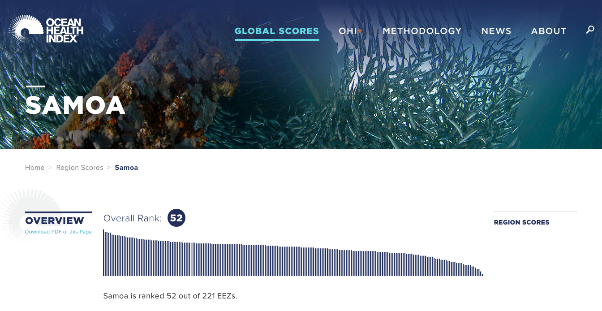
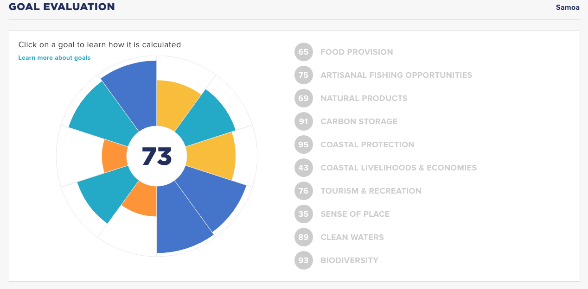

```{r setup, include=FALSE}
knitr::opts_chunk$set(message = FALSE, warning=FALSE)
```


```{r setup2, echo=FALSE}

## libraries
library(tidyverse)
library(knitr)

## filepaths
raw_prefix <- 'https://raw.githubusercontent.com/OHI-Science'
```

```{r country focus, echo=FALSE}
## country focus
key <- 'sam'
rgn_name <- 'Samoa'
```


```{r rgn info, echo=FALSE, message=FALSE}
## get global rgn_ids
rgn_global <- read_csv(file.path(raw_prefix, 'ohirepos-log/master/rgn_global.csv')) %>%
  filter(label == rgn_name)
```

## Introduction

This workshop compliments <http://ohi-science.org/country-opportunities-training>.

## Explore oceanhealthindex.org

Let's start off by looking at [oceanhealthindex.org/region-scores](http://www.oceanhealthindex.org/region-scores) and typing in the country of interest, for example: [Samoa](http://www.oceanhealthindex.org/region-scores/scores/samoa).



You can see scores and ranks at a glance. In 2017, Samoa was ranked 52 out of 221 EEZs, with an overall score of 73/100. 

<!---draw this from scores.csv/analyses --->

## Goals Assessed

The flower plot shows that all 10 goals were assessed for Samoa. 



<!---
 

(do this in R so can sub sam and Samoa) --->

## Pressures and resilience

```{r}
x <- read_csv('https://raw.githubusercontent.com/OHI-Science/sam/master/eez/conf/pressures_matrix.csv', na = character())

knitr::kable(x)

```


