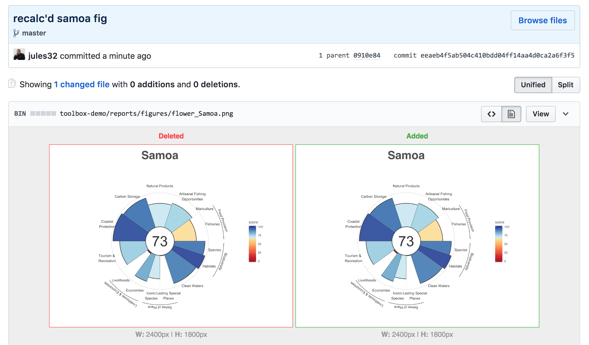

```{r setup, include=FALSE}
knitr::opts_chunk$set(warning = FALSE, message=FALSE)
```

## Intro

This will help us get started with substituting Samoa data into the Toolbox. This is setup for LSP but we can work through other examples as well. 


```{r setup2}
## load libraries necessary
library(tidyverse) # install.packages("tidyverse")
library(ohicore)   # install_github("ohicore")

## identify region identifier for Samoa
rgn_id_sam <- 152
```

## LSP

### New data

First read in new data. In this example we have saved the new WDPA data from May 2018 in a folder called workshop-data.

```{r read in}
wdpa <- read_csv("workshop-data/WDPA_May2018.csv")

wdpa %>%
  select(NAME, REP_M_AREA, STATUS, STATUS_YR, NO_TK_AREA)
```

Summarize the total areas within MPAs:

```{r total area}
mpa_area_total <- wdpa %>%
  group_by(STATUS_YR) %>%
  mutate(AREA_KM2 = sum(REP_M_AREA)) %>%
  select(NAME, REP_M_AREA, STATUS, STATUS_YR, NO_TK_AREA, AREA_KM2)
mpa_area_total

mpa_area_total_sam <- unique(mpa_area_total$AREA_KM2)
```

So since all were designated in the same year, `r mpa_area_total_sam` is the total recorded since 1999.

### Current Toolbox Data

Inspect LSP data layer: 

```{r inspect LSP data layer}
lsp_prot_area_offshore3nm <- read_csv("layers/lsp_prot_area_offshore3nm.csv")

## display
lsp_prot_area_offshore3nm  %>%
  filter(rgn_id == rgn_id_sam)
```


Since the WDPA data shows that all were designated in 1999, and the OHI LSP data layer begins with 2000, we can inject `r mpa_area_total_sam` for all years.

### Substitute new data

Inject in LSP data layer. 

```{r inject datalayer}
## base-R
# lsp_prot_area_offshore3nm$a_prot_3nm[lsp_prot_area_offshore3nm$rgn_id == rgn_id_sam] <- mpa_area_total_sam

## tidyverse
lsp_new <- rbind(
  lsp_prot_area_offshore3nm %>%
    filter(rgn_id != rgn_id_sam), 
  lsp_prot_area_offshore3nm %>%
    filter(rgn_id == rgn_id_sam) %>%
    mutate(a_prot_3nm = mpa_area_total_sam)) %>%
  arrange(rgn_id, year)

## save new data in existing layer
write_csv(lsp_new, "layers/lsp_prot_area_offshore3nm.csv")
```

We can check in the differences in GitHub and see that Samoa's data have been updated. 

###  Recalculate scores

```{r}
source("calculate_scores.R")
```


Inspect new scores. The best way to do this is by looking at the GitHub differences in scores.csv and in the flower plot. 

The overall Index score changed slightly, and the LSP goal did as well. 

In this example, the change is too small to be visible in the flower plot:




We can also look at the scores in R:

```{r}
scores <- read_csv("scores.csv")

scores %>%
  filter(region_id == rgn_id_sam, 
         goal == "LSP")
```

