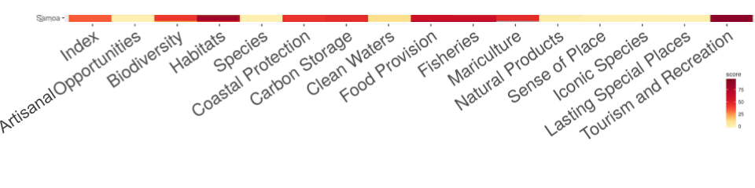

```{r setup, include=FALSE}
knitr::opts_chunk$set(warning = FALSE)
```

```{r setup sam, echo=FALSE, message=FALSE, warning=FALSE}
## libraries
library(tidyverse)
library(DT)

## country focus
key <- 'sam'
rgn_name <- 'Samoa'

## filepaths
raw_prefix <- 'https://raw.githubusercontent.com/OHI-Science'
rawkey_prefix <- file.path('https://raw.githubusercontent.com/OHI-Science', key, "master")


## read in data from web (minimize how often pull from web) ----

scores_gf_csv <- read_csv(file.path(rawkey_prefix, "global2015/gapFilling/scores.csv")) 
scores_csv <- read_csv(file.path(rawkey_prefix, "eez/scores.csv")) 
fis_meancatch_csv <- read_csv(file.path(rawkey_prefix, "/eez/layers/fis_meancatch.csv"))
fis_b_bmsy_csv <- read_csv(file.path(rawkey_prefix, "/eez/layers/fis_b_bmsy.csv"))

## get global rgn_id
rgn_global <- read_csv(file.path(raw_prefix, 'ohirepos-log/master/rgn_global.csv')) %>%
  filter(label == rgn_name) # 152
```

## Objectives and Resources

Today we'll be looking at the data for Samoa from the Global Assessments. We will start off looking at gapfilling to focus our attention. 

**Objectives**

**Resources**


## Gapfilling in Samoa

Yesterday we discussed some of the data sources that go into global assessments, and gapfilling. 

Let's look at Samoa in the gapfilling "carpet plot". This plot is meant to show an overall picture of gapfilling in global assessments. Each row is a different country, and each column is a different goal. In these plots, reds mean the highest amounts of gapfilling, yellows are the least, and grey means not applicable. 


<br>

### Figure: Carpetplot

We can zoom in on Samoa: 



Looking at the red goals, it seems that goals involving habitat data (HAB, CP, CS), as well as Food Provision (FIS and MAR) and Tourism & Recreation are the goals with the most gapfilling. This means that these data are not reported by Samoa, but instead estimated. In yellow, this figure shows that AO, SPP, CW, NP, and SP (LSP, SPP) have the least amount of gapfilling and are most representative of data.

Let's look a bit deeper to see numerically the percent gapfilling by goal. This confirms what we saw above but with more information. We can pull directly from the data from the Frazier et al. publication:

```{r, echo=FALSE}
scores_gf <- scores_gf_csv %>% 
  filter(region_id == rgn_global$rgn_id,
         dimension == "status") %>%
  select(goal, percent_gapfilled = score) %>%
  arrange(percent_gapfilled) 

scores_gf %>%
  DT::datatable()
```

<br>

What is very interesting is to compare the percent gapfilling by goal to the scores per goal. It looks like HAB had the highest score but also some of the highest percentage of gapfilling. 

### Table: % Gapfilled vs. Scores

We can see this as a table. Here it is arranged by percent gapfilled, but we can also arrange by score.

```{r, echo=FALSE}
scores <- scores_csv %>% 
  filter(region_id == rgn_global$rgn_id,
         dimension == "status",  
         year == max(year)) %>%
  select(goal, score) %>%
  arrange(goal) 

scores_plot <- scores %>%
  left_join(scores_gf, by = "goal") %>% 
  arrange(percent_gapfilled)

scores_plot %>% 
  DT::datatable()
```

<br>

### Figure: % Gapfilled vs. Scores

But it can also be nice to see it as a figure:

```{r, echo=FALSE, warning=FALSE}
ggplot(data = scores_plot, aes(x = score, y = percent_gapfilled, label = goal)) + 
  geom_point() + 
  geom_text(aes(label = goal), nudge_x = 3, nudge_y = 1)

## can also assign above to p then:
# ggplotly(p)
```


## Gapfilling Discussion

There are a lot of things we can talk about from this figure. What do you see? Let's list potential topics and then we will dive further into each of them. 

<br>

### Overall 

**Observations:**

- Two goals are 100% gapfilled (TR, HAB)
- Samoa has a lot of goals (~11) with scores over 50 (on the x-axis)
- There are ~7 goals where % gapfilling is under 12.5% (on the y-axis)
- Some high-scoring goals have high % gapfilling, some have low

**Discussion:**

- What should we explore now that could help inform Tier 2 or OHI+?

<br>

### Tourism and Recreation (TR)

**Observations:**

- TR has the highest amount of gapfilling compared to any goal. 

**Discussion:**

- What would be better ways to model TR for Samoa? What is important to capture?
- What data are available locally in Samoa?

<br>

### Food Provision (FP)

**Observations:**

- FP and FIS are plotted on top of each other, which means that the FP score is the same as FIS (we can also see this from the table above). This means that MAR contributes nothing to the FP score, and in fact the MAR score is 0. 

**Discussion:**

- Why is the MAR score 0?
- FIS has quite a bit of gapfilling (`r x <- scores_gf %>% filter(goal == "FIS"); x$percent_gapfilled`%), which data or species are gapfilled?

<br>

### Habitat-based goals (HAB, CS, CP)

**Observations**:

- HAB is the goal with the highest amount of gapfilling and highest score
- CP, CS, and HAB rely on much of the same data. 

**Discussion:**

- Which habitats are heavily gapfilled in HAB? (Or, which are not gapfilled in CP, CS?)

<br>

### Livelihoods and Economies (LE, LIV, ECO)

**Observations**:

- The LE goal is not on the figure. We didn't include them in our gapfilling analyses because our models rely on old data (pre-2012). 

**Discussion:**

- LE, LIV, ECO would be a good choice for improving.

<br>
