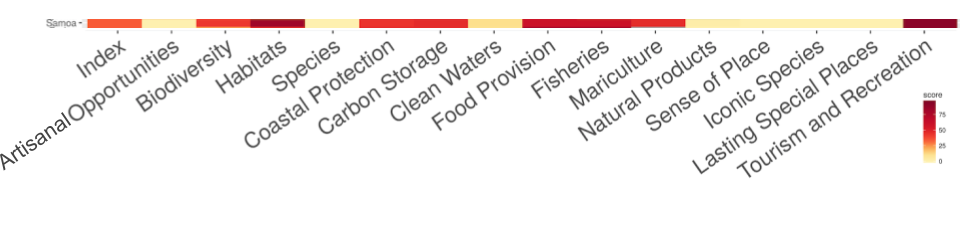
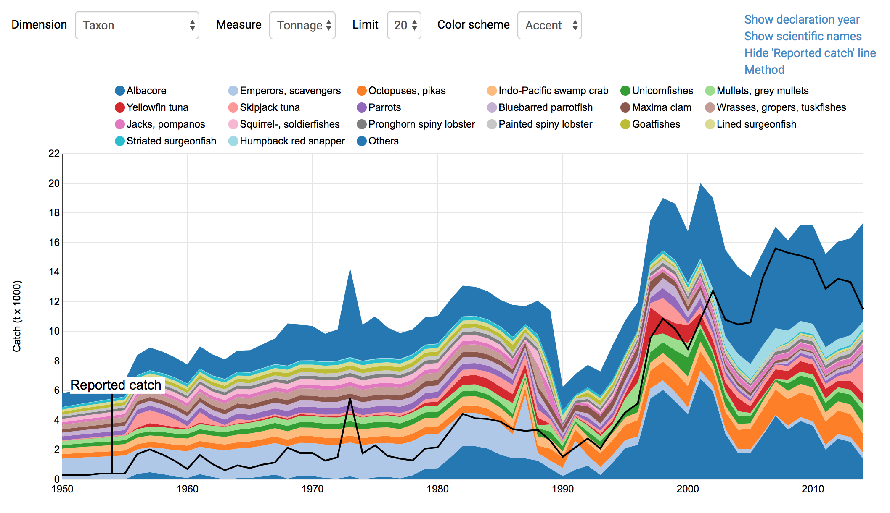
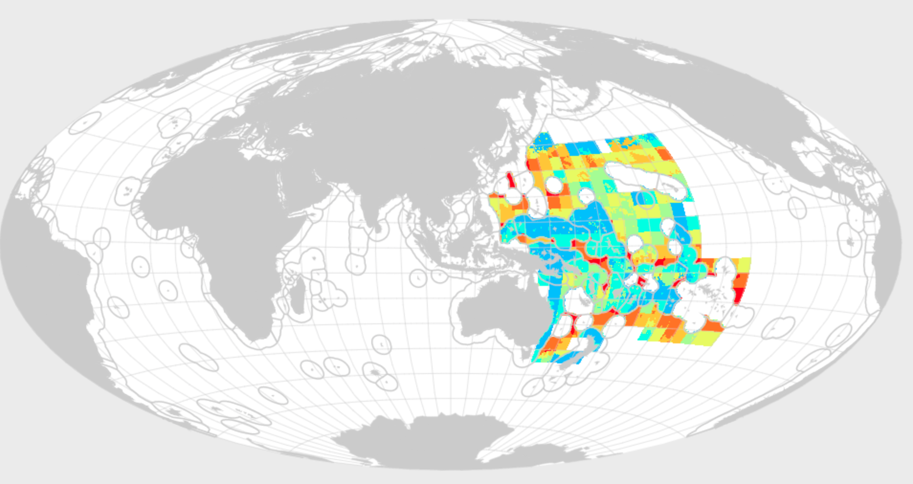

```{r setup, include=FALSE}
knitr::opts_chunk$set(warning = FALSE, message=FALSE)
```

```{r setup for country focus, echo=FALSE}
## country focus: edit this for your country.
## make sure the rgn_name matches exactly: https://github.com/OHI-Science/ohirepos-log/blob/master/rgn_global.csv
key <- 'sam'
rgn_name <- 'Samoa'
```

```{r setup files, echo=FALSE}
## libraries
library(tidyverse)
library(DT)


## to build filepaths ----
##local! - comment these out if preferred remote
rawkey_prefix <- "~/github/sam_master"
rawprep_prefix <- "~/github/ohiprep_v2017"
## remote!! - comment these out if you have cloned locally
# rawkey_prefix <- file.path('https://raw.githubusercontent.com/OHI-Science', key, "master")
# rawprep_prefix <- "https://raw.githubusercontent.com/OHI-Science/ohiprep_v2017/master/"


## read in data from web (minimize how often pull from web) ----

## get global rgn_id
rgn_global <- read_csv(file.path(rawkey_prefix, 'eez/layers/rgn_global.csv')) %>%
  filter(label == rgn_name) # sam is 152

## scores, gapfilling
scores_csv <- read_csv(file.path(rawkey_prefix, "eez/scores.csv")) 
scores_gf_csv <- read_csv(file.path(rawkey_prefix, "global2015/gapFilling/scores.csv")) 

## FP
fis_meancatch_csv <- read_csv(file.path(rawkey_prefix, "eez/layers/fis_meancatch.csv"))
fis_b_bmsy_csv <- read_csv(file.path(rawkey_prefix, "eez/layers/fis_b_bmsy.csv"))
fis_b_bmsy_gf_csv <- read_csv(file.path(rawkey_prefix, "global2017/gapfilling/layers/fis_b_bmsy.csv"))
mar_harvest_tonnes_csv <- read_csv(file.path(rawkey_prefix, "eez/layers/mar_harvest_tonnes.csv"))
taxon_lookup_csv <- read_csv(file.path(rawprep_prefix, "globalprep/fis/v2017/data/taxon_resilience_lookup.csv"))


## NP
np_harvest_tonnes_csv <- read_csv(file.path(rawkey_prefix, "global2017/gapfilling/layers/np_harvest_tonnes.csv"))

## Species goals
ico_spp_cat_csv <- read_csv(file.path(rawprep_prefix, "globalprep/spp_ico/v2017/int/ico_spp_cat.csv")) ## maybe don't need
ico_spp_rgn_prepped_csv <- read_csv(file.path(rawprep_prefix, "globalprep/spp_ico/v2017/int/ico_spp_rgn_prepped.csv")) ## maybe don't need
risk_code_lookup <- read_csv(file.path(rawprep_prefix, "globalprep/spp_ico/v2017/raw/risk_code_lookup.csv"))
rgn_spp_gl_csv <- read_csv("~/github/ohi-global2017-template/mazu_local/rgn_spp_gl.csv") # this filepath will depend on where you saved this locally
ico_spp_iucn_status_csv <- read_csv(file.path(rawprep_prefix, "globalprep/spp_ico/v2017/output/ico_spp_iucn_status.csv"))
ico_global_list <- read_csv(file.path(rawprep_prefix, "globalprep/spp_ico/v2017/int/ico_global_list.csv"))


## Habitat goals
hab_mangrove_extent_csv <- read_csv(file.path(rawkey_prefix, "eez/layers/hab_mangrove_extent.csv"))
hab_seagrass_extent_csv <- read_csv(file.path(rawkey_prefix, "eez/layers/hab_seagrass_extent.csv"))
hab_saltmarsh_extent_csv <- read_csv(file.path(rawkey_prefix, "eez/layers/hab_saltmarsh_extent.csv"))
hab_coral_extent_csv <- read_csv(file.path(rawkey_prefix, "eez/layers/hab_coral_extent.csv"))
hab_seaice_extent_csv <- read_csv(file.path(rawkey_prefix, "eez/layers/hab_seaice_extent.csv"))
hab_softbottom_extent_csv <- read_csv(file.path(rawkey_prefix, "eez/layers/hab_softbottom_extent.csv"))

## LSP
lsp_prot_area_inland1km_csv <- read_csv(file.path(rawkey_prefix, "eez/layers/lsp_prot_area_inland1km.csv"))
lsp_prot_area_offshore3nm_csv <- read_csv(file.path(rawkey_prefix, "eez/layers/lsp_prot_area_offshore3nm.csv"))       
```

## Objectives

Following the [presentation](https://docs.google.com/presentation/d/1myCjWaUp6kXGMJbBOE3kOoZO_-miicKluN_2hlzcFVo/edit#slide=id.g37b2a5357d_0_288) about OHI Global data and data gaps, let's explore the OHI Global data for Samoa. We will continue with gapfilling to focus our attention. 

<!---
This is now covered in the presentation: https://docs.google.com/presentation/d/1myCjWaUp6kXGMJbBOE3kOoZO_-miicKluN_2hlzcFVo/edit#slide=id.g37b2a5357d_0_254
## Gapfilling in Samoa

Let's look at Samoa in the gapfilling "carpet plot". This plot is meant to show an overall picture of gapfilling in global assessments. Each row is a different country, and each column is a different goal. In these plots, reds mean the highest amounts of gapfilling, yellows are the least, and grey means not applicable. 


<br>

### Figure: Carpetplot

We can zoom in on Samoa: 



Looking at the red goals, it seems that goals involving habitat data (HAB, CP, CS), as well as Food Provision (FIS and MAR) and Tourism & Recreation are the goals with the most gapfilling. This means that these data are not reported by Samoa, but instead estimated. In yellow, this figure shows that AO, SPP, CW, NP, and SP (LSP, SPP) have the least amount of gapfilling and are most representative of data.

--->

## Gapfilling in Samoa

Let's look a bit deeper to see numerically the percent gapfilling by goal. This confirms what we saw above but with more information. We can pull directly from the data from the [Frazier et al. 2015](http://journals.plos.org/plosone/article?id=10.1371/journal.pone.0160377) publication:

```{r scores_gf samoa, echo=FALSE}
scores_gf <- scores_gf_csv %>% 
  filter(region_id == rgn_global$rgn_id,
         dimension == "status") %>%
  select(goal, percent_gapfilled = score) %>%
  arrange(percent_gapfilled) 


```

<br>

It's also interesting to compare the percent gapfilling by goal to the scores per goal. It looks like HAB had the highest score but also some of the highest percentage of gapfilling. 

### Table: % Gapfilled vs. Scores

We can see this as a table. Here it is arranged by percent gapfilled, but we can also arrange by score.

```{r, echo=FALSE}
scores <- scores_csv %>% 
  filter(region_id == rgn_global$rgn_id,
         dimension == "status",  
         year == max(year)) %>%
  select(goal, score) %>%
  arrange(goal) 

scores_plot <- scores %>%
  left_join(scores_gf, by = "goal") %>% 
  arrange(percent_gapfilled)

##TODO: default arrangement by goal/subgoal, and then 

##Talk to Mel about species synonyms (to know about it)

scores_plot %>% 
  DT::datatable()
```

<br>

### Figure: % Gapfilled vs. Status Scores

But it can also be nice to see it as a figure:

```{r, echo=FALSE, warning=FALSE}
ggplot(data = scores_plot, aes(x = score, y = percent_gapfilled, label = goal)) + 
  geom_point() + 
  geom_text(aes(label = goal), nudge_x = 3, nudge_y = 1)

## can also assign above to p then:
# ggplotly(p)
```


## Gapfilling Observations

There are a lot of things we can talk about from this figure. What do you see? 

Let's list potential topics and then we will dive further into each of them. 

### Overall 

**Observations:**

- Two goals are 100% gapfilled (TR, HAB)
- Samoa has a lot of goals (~11) with scores over 50 (on the x-axis)
- There are ~7 goals where % gapfilling is under 12.5% (on the y-axis)
- Some high-scoring goals have high % gapfilling, some have low

<br>

### Tourism and Recreation (TR)

**Observations:**

- TR has the highest amount of gapfilling compared to any goal. 

<br>

### Habitat-based goals (HAB, CS, CP)

**Observations**:

- HAB is the goal with the highest amount of gapfilling and highest score
- CP, CS, and HAB rely on much of the same data. 

<br>

### Food Provision (FP)

**Observations**:

- FP and FIS are plotted on top of each other, which means that the FP score is the same as FIS (we can also see this from the table above). This means that MAR contributes nothing to the FP score, and in fact the MAR score is 0. 

<br>

### Lasting Special Places (LSP)

**Observations**:

- LSP has a very low score, and is not gapfilled. 


### Species-based goals (ICO, SPP)

- these scores are quite high and are not gapfilled (0). 


### Livelihoods and Economies (LE, LIV, ECO)

**Observations**:

- The LE goal is not on the figure. We didn't include them in our gapfilling analyses because our models rely on old data (pre-2012). 


What order should we discuss these?

----

## Data discussion: deep dive

## [Food Provision: Fisheries](http://ohi-science.org/ohi-global/goals.html#food_provision:_fisheries)

**Questions:**

- FIS has quite a bit of gapfilling (64%), which data or species are gapfilled?

<br>

<!----
#### Global Model

To refresh our minds, we can look at [ohi-science.org/ohi-global/goals](http://ohi-science.org/ohi-global/goals#food_provision:_fisheries)

> "The model assess the amount of wild-caught seafood that can be sustainably harvested, with sustainability based on multi-species yield, and with penalties assigned for both over- and under-harvesting. Each taxa landed within each FAO major fishing area is assessed separately based on B/BMSY (maxium sustainable yield) and weighted by its relative contribution to overall catch. The goal status score for each reporting region in each year was calculated as the geometric mean of the all stock status scores."

The Fisheries (FIS) subgoal measures wildcaught fish catch within your EEZ (if your country fishes outside the EEZ and lands that catch in your country, that is not included). Our models need catch for at least 10 years (20 is better). Ideally, we would also have status of each species stock (at least B/BMSY, bonus is F/FMSY). We use both catch and B/BMSY information when we have it, but for some species we only have catch data. 

Global data are from the [Sea Around Us Project](http://www.seaaroundus.org).

<  !---
The criteria we use for our fisheries model is data that has:

- catch by species: only what is fished within Samoa's EEZ
- years: at least 10 years of data (preferably 20)

Depending on the format, we'd be able to update data for those species, recalculate either with only those species, or mix-and-match SAUP and local data.

*Note*: we cannot add new species in this workshop, that is for Tier 2. That will take more attention and time than we can give. We would need to add meancatch values, as well as matching b_bmsy estimates.

--->

#### Global Data

We can look on their website at an interactive visualization of [fish caught in Samoa's EEZ](http://www.seaaroundus.org/data/#/eez/882?chart=catch-chart&dimension=taxon&measure=tonnage&limit=20):



We can also look at an interactive visualization of [Samoa fishing around the world](http://www.seaaroundus.org/data/#/spatial-catch?entities=192) (mostly high seas and agreements with other countries). So although Samoa fishes further than its own EEZ, we don't include a lot of that catch. 



<br>

Let's look through the species listed and see if there are any included that don't represent Samoa's fisheries within the EEZ; we can remove them (but we won't be adding additional species in this workshop). 

Then, we can look at the mean catch estimates for certain species, especially for catch that is grouped instead of by species. If better local data are available, we can try to substitute these data.

#### Mean catch 

Let's look at the list of species that are represented in the FIS model as mean catch: (the [fis_meancatch](https://github.com/OHI-Science/sam/blob/master/eez/layers/fis_meancatch.csv) layer):

TODO
mean_catch is rather a historic list because some things may not be caught any more. If it was a big catch in the past but now is 0, it will still average. it keeps things in the dataset. 

```{r fis_meancatch list, echo=FALSE}
fis_meancatch <- fis_meancatch_csv %>%
  filter(rgn_id == rgn_global$rgn_id) %>%
  mutate(stock_name = str_remove_all(stock_id_taxonkey, "-[0-9]+_[0-9]+"))

taxon_lookup <- taxon_lookup_csv %>%
  mutate(stock_name = str_replace(sciname, " ", "_"))

fis_meancatch_lookup <- left_join(
  fis_meancatch %>%
    distinct(stock_name),
  taxon_lookup, by = "stock_name") %>%
  select(stock_name, common)

## display as interactive DT table
fis_meancatch_lookup %>%
  DT::datatable()

## save as csv: 
fis_meancatch_lookup %>% write_csv("data/fis_meancatch_lookup_sam.csv")
```

There are `r fis_meancatch_lookup %>% nrow()` species in the [fis_meancatch](https://github.com/OHI-Science/sam/blob/master/eez/layers/fis_meancatch.csv) layer for Samoa.

We can look at this another way in the presentation.

<!---
If we want to look up a single species, like red snapper (*Xiphias_gladius*): The values are all the same: this is the mean catch throughout the period. 

```{r fis_meancatch sp, echo=FALSE}
fis_meancatch %>%
  filter(stock_name == "Xiphias_gladius") %>%
  knitr::kable()
```

--->
#### Raw catch data

To understand mean catch, dive into catch by species. This might be best to view from within RStudio.

<!--- downloaded from Mazu git-annex/globalprep/fis/v2017/int/stock_catch_by_rgn.csv, filtered for sam and saved locally in sam/data --->

```{r stock_catch_by_rgn.csv}

stock_sam <- readr::read_csv("data/stock_catch_by_rgn_sam.csv")
# View(stock_sam)

```

TODO:
"We would have to look at this more carefully and this is where it would occur"

TODO: note to self:
If wanted to add new species data, don't add it to mean_catch; add it to the raw and then recalculate using this.
https://github.com/OHI-Science/ohiprep_v2018/blob/master/globalprep/fis/v2017/catch_data_prep.Rmd

#### B/Bmsy

These are the species stocks that we have data for [fis_b_bmsy](https://github.com/OHI-Science/sam/blob/master/eez/layers/fis_b_bmsy.csv):

```{r fis_b_bmsy list, echo=FALSE}
fis_b_bmsy <- fis_b_bmsy_csv %>%
  filter(rgn_id == rgn_global$rgn_id) %>%
  mutate(stock_name = str_remove_all(stock_id, "-[0-9]+"))

taxon_lookup <- taxon_lookup_csv %>%
  mutate(stock_name = str_replace(sciname, " ", "_"))

fis_b_bmsy_lookup <- left_join(
  fis_b_bmsy %>%
    distinct(stock_name), 
  taxon_lookup, by = "stock_name") %>%
  select(stock_name, common)
  
## display as interactive DT table
fis_b_bmsy_lookup %>%
  DT::datatable()

## save as csv:
fis_b_bmsy_lookup %>% write_csv("data/fis_b_bmsy_lookup_sam.csv")
```

There are only `r fis_b_bmsy_lookup %>% nrow()` species in the [fis_b_bmsy](https://github.com/OHI-Science/sam/blob/master/eez/layers/fis_b_bmsy.csv) layer for Samoa.

Are there any species that don't seem right?

<!---
If we want to look up b_bmsy for a single species, like red snapper (*Xiphias_gladius-77*):

```{r fis_b_bmsy sp, echo=FALSE}
fis_b_bmsy %>%
  filter(stock_id == "Xiphias_gladius-77") %>%
  knitr::kable()
```

--->

<!---

#### Gapfilling

Which FIS species are gapfilled?

```{r fis_b_bmsy gf list, echo=FALSE}
## change this to 
fis_b_bmsy_gf <- fis_b_bmsy_gf_csv %>%  
  filter(region_id == rgn_global$rgn_id) 

fis_b_bmsy_gf %>%
  filter(gapfilled == 1) %>%
  DT::datatable()

```

The proportion of gapfilled : not gapfilled is: `r fis_b_bmsy_gf %>% filter(gapfilled == 1) %>% nrow()` : `r fis_b_bmsy_gf %>% filter(gapfilled == 0) %>% nrow()`

All b_bmsy values are gapfilled. 

We don't have information on the catch that is gapfilled.
--->

#### Discussion

- Are there any species that don't seem right and we should remove, for meancatch or B/Bmsy?
- There are many categories that we only have information at the genus or family levels. Do you have information for species level?


<br>

## [Food Provision: Mariculture](http://ohi-science.org/ohi-global/goals.html#food_provision:_mariculture)

**Questions:**

- Why is the MAR score 0?

### Global Data 

#### Tonnes of Harvest

Let's look at the list of species that are represented in the MAR model as tonnes of harvest: (the [mar_harvest_tonnes](https://github.com/OHI-Science/sam/blob/master/eez/layers/mar_harvest_tonnes.csv) layer):

```{r mar_harvest_tonnes, echo=FALSE}
mar_harvest_tonnes <- mar_harvest_tonnes_csv %>%
  filter(rgn_id == rgn_global$rgn_id) %>%
  mutate(taxa = str_remove_all(taxa_code, "_.*"))

## display as interactive DT table
  mar_harvest_tonnes %>%
    distinct(taxa) %>%
  DT::datatable()
```

So there are only 5 species reported to FAO, and they are all clams. 

Let's have a peek at the data: 

```{r mar_harvest_tonnes data, echo=FALSE}

mar_harvest_tonnes %>%
  select(-rgn_id, taxa_code) %>%
  group_by(taxa_code) %>%
  summarize(year_min = min(year),
            year_max = max(year),
            total_tonnes = sum(tonnes),
            mean_tonnes  = mean(tonnes)) %>%
  DT::datatable()
```

#### Discussion

- are better data available for these species?
- are there other species that should be represented in Samoa?

<br>

## Habitat-based goals

**Questions:**

- Which habitats are heavily gapfilled in HAB? (Or, which are not gapfilled in CP, CS?)

### Global Data

**[Carbon Storage](http://ohi-science.org/ohi-global/goals.html#carbon_storage)**: 3 coastal habitats: mangroves, seagrasses, and salt marshes

**[Coastal Protection](http://ohi-science.org/ohi-global/goals.html#coastal_protection)**: 5 coastal habitats: mangroves, seagrasses, salt marshes, coral reefs, and sea ice (although not in Samoa!)

**[Habitats (BD sub-goal)](http://ohi-science.org/ohi-global/goals.html#biodiversity:_habitats)**: 6 coastal habitats: mangroves, seagrasses, salt marshes, coral reefs, sea ice, and subtidal soft-bottom habitats

#### Habitat extent
TODO condition. extent is not gapfilled. but Condition is almost always gapfilled. extent is ~half of the calculation. For status. 

HAB is entirely condition, which is all gapfilled for most places. One of our worst data sets.
CP, CS goes down by ~50% because extent is ~1/2 of the score and extent is not gapfilled. (also mangrove trend is not gapfilled

Let's have a look at the data included for Samoa:

```{r hab data, echo=FALSE, message=FALSE, warning=FALSE}
## extract
hab_mangrove_extent <- hab_mangrove_extent_csv %>%
  filter(rgn_id == rgn_global$rgn_id)

hab_seagrass_extent <- hab_seagrass_extent_csv %>%
  filter(rgn_id == rgn_global$rgn_id)

hab_saltmarsh_extent <- hab_saltmarsh_extent_csv %>%
  filter(rgn_id == rgn_global$rgn_id)

hab_coral_extent <- hab_coral_extent_csv %>%
  filter(rgn_id == rgn_global$rgn_id)

hab_seaice_extent <- hab_seaice_extent_csv %>%
  filter(rgn_id == rgn_global$rgn_id)

hab_softbottom_extent <- hab_softbottom_extent_csv %>%
  filter(rgn_id == rgn_global$rgn_id)

hab_extent_samoa <- rbind(
  hab_mangrove_extent,
  hab_seagrass_extent,
  hab_saltmarsh_extent,
  hab_coral_extent,
  hab_seaice_extent,
  hab_softbottom_extent) 

hab_extent_samoa %>%
  DT::datatable()
```

So there is not a lot of data available for Samoa. This means that the goals are actually represented by this: 

**Carbon storage**: 2 coastal habitats: mangroves (but the data is 0), seagrasses

**Coastal Protection**: 3 coastal habitats: mangroves (but the data is 0), seagrasses, coral reefs

**Habitats sub-goal**: 3 coastal habitats: mangroves (but the data is 0), seagrasses, coral reefs


#### Discussion

- Are there better data available? 
- Should we look into the gapfilling question more?

## [Tourism & Recreation](http://ohi-science.org/ohi-global/goals.html#tourism__recreation)

TR is 100% gapfilled for Samoa.

**Questions:**

- What would be better ways to model TR for Samoa? What is important to capture?
- What data are available locally in Samoa?
- Is there local data to represent percent direct employment in tourism (tr_jobs_pct_tourism): Percent direct employment in tourism?

## Natural Products

### Global Data

Which Natural Products are included for Samoa?

```{r np, echo=FALSE}
np_harvest_tonnes <- np_harvest_tonnes_csv %>%
  filter(rgn_id == rgn_global$rgn_id)

np_harvest_tonnes %>%
  distinct(commodity, product) %>%
  DT::datatable()
```

So there are two products here.

We can also look at how much of this was gapfilled:
```{r np_gf, echo=FALSE}
## shows gapfilling too
np_harvest_tonnes %>%
  DT::datatable()

```

#### Discussion

- are there other products that should be included?
- is this a goal that represents Samoa well?

## [Lasting Special Places](http://ohi-science.org/ohi-global/goals.html#sense_of_place:_lasting_special_places)


### Global Data

The model measures the percentage of coastal marine protected area and protected coastline in each country, against a reference percentage. 

```{r lsp, echo=FALSE}
lsp_prot_area_inland1km <- lsp_prot_area_inland1km_csv %>%
  filter(rgn_id == rgn_global$rgn_id)

lsp_prot_area_offshore3nm <- lsp_prot_area_offshore3nm_csv %>%
  filter(rgn_id == rgn_global$rgn_id)

lsp_combo <- left_join(
  lsp_prot_area_inland1km,
  lsp_prot_area_offshore3nm, 
  by = c("rgn_id", "year")) %>%
  select(-rgn_id)
  
lsp_combo %>%
  DT::datatable()

```

#### Discussion

- are there coastal or marine parks that are not accounted for?


## Species-based goals

### Global data

```{r spp count, echo=FALSE}
## filter and join species name
rgn_spp_gl <- rgn_spp_gl_csv %>%
  filter(rgn_id == rgn_global$rgn_id) %>%
  left_join(ico_global_list %>%
              select(sciname, comname), 
            by = "sciname") %>%
  select(sciname, comname, iucn_sid, cat_score) # n_spp_rgn; this = n_rows: 1467 for samoa
```

```{r ico count, echo=FALSE}
## filter and join species name
ico_spp_iucn_status <- ico_spp_iucn_status_csv %>%
  filter(rgn_id == rgn_global$rgn_id) %>%
  left_join(ico_global_list %>%
              select(sciname, comname), 
            by = "sciname") %>%
  select(sciname, comname, iucn_sid, year, category)
```

**[Species subgoal of Biodiversity](http://ohi-science.org/ohi-global/goals.html#biodiversity:_species)**: There are `r nrow(rgn_spp_gl)` unique species for `r rgn_name`

**[Iconic Species subgoal of Sense of Place](http://ohi-science.org/ohi-global/goals.html#sense_of_place:_iconic_species)**: There are `r nrow(ico_spp_iucn_status)` unique species for `r rgn_name`

For Species, there are probably more than we can go through today. But, here is a table that has the full list:

```{r spp display, echo=FALSE}
## display
rgn_spp_gl %>%
  select(comname, sciname) %>%
  DT::datatable()
```

It might be more manageable to work with the Iconic Species list:

```{r ico display, echo=FALSE}
## join iucn category language
ico_spp_code <- ico_spp_iucn_status %>%
  dplyr::rename(cat_code = category) %>%
  left_join(risk_code_lookup %>%
              select(cat_code = code,
                     category, 
                     cat_score) %>%
              distinct(), 
            by = "cat_code")

## display
ico_spp_code %>%
  select(comname, sciname, cat_code) %>%
  DT::datatable()
```

This is something that we could explore and we could potentially recalculate together. 

<!---
Recalculating would be easy for ICO bc no area-weighting. Could edit this file directly: ico_spp_iucn_status.csv bc read into ICO function. (NC/LV)
--->

## Discussion and Next Steps

- We'll explore the "local" data you have for fisheries and other goals and see if we can incorporate this into the Toolbox. 
- we will capture the discussion we have, in particular about FP, TR, Habitat-based goals.


## Other topics (parking lot)

## Pressures and Resilience!

2017 report: 

- It has been suggested to not use bycatch data for OHI assessment.
- pollution

2016 report:

- crown of thorns
- coastal development

We can also look at the gapfilling plot above along with the global average. 

```{r, echo=FALSE, eval=FALSE}
scores_gf_compare <- scores_gf_csv %>% 
  filter(region_id %in% c(rgn_global$rgn_id, 0),
         dimension == "status") %>%
  select(goal, region_id, percent_gapfilled = score) %>%
  arrange(region_id, percent_gapfilled) 

scores_compare <- scores_csv %>% 
  filter(region_id %in% c(rgn_global$rgn_id, 0),
         dimension == "status",  
         year == max(year)) %>%
  select(goal, region_id, score) %>%
  arrange(region_id) 

scores_plot_compare <- scores_compare %>%
  left_join(scores_gf_compare, by = c("goal", "region_id")) %>% 
  arrange(percent_gapfilled) %>%
  mutate(region_name = region_id) %>%
  mutate(region_name = str_replace_all(region_name, "152", "Samoa")) %>%
  mutate(region_name = str_replace_all(region_name, "0", "Global"))

ggplot(data = scores_plot_compare, aes(x = score, y = percent_gapfilled, label = goal, color = region_name)) + 
  geom_point() + 
  geom_text(aes(label = goal), nudge_x = 3, nudge_y = 1)
```


