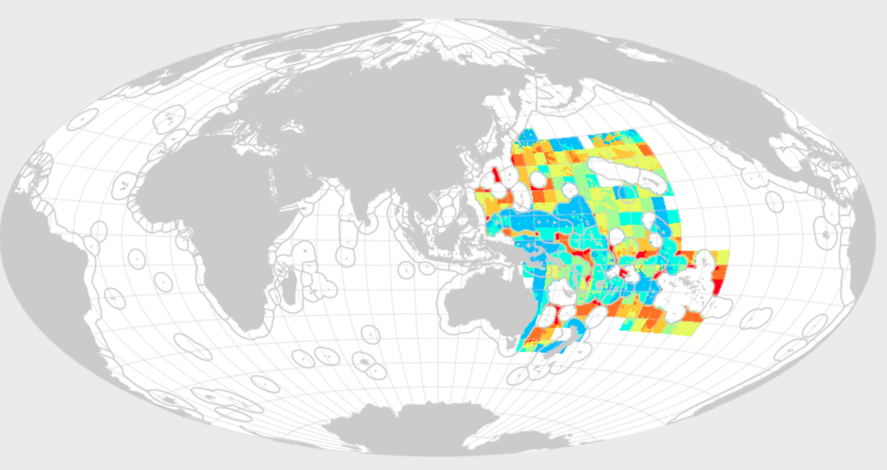

```{r setup, include=FALSE}
knitr::opts_chunk$set(warning = FALSE)
```

```{r setup sam, echo=FALSE, message=FALSE, warning=FALSE}
## libraries
library(tidyverse)
library(DT)

## country focus
key <- 'sam'
rgn_name <- 'Samoa'

## filepaths
raw_prefix <- 'https://raw.githubusercontent.com/OHI-Science'
rawkey_prefix <- file.path('https://raw.githubusercontent.com/OHI-Science', key, "master")


## read in data from web (minimize how often pull from web) ----

fis_meancatch_csv <- read_csv(file.path(rawkey_prefix, "eez/layers/fis_meancatch.csv"))
fis_b_bmsy_csv <- read_csv(file.path(rawkey_prefix, "eez/layers/fis_b_bmsy.csv"))
taxon_lookup_csv <- read_csv(file.path(raw_prefix, "ohiprep/master/globalprep/fis/v2017/data/taxon_resilience_lookup.csv"))

## fix later
fis_b_bmsy_gf_csv <- read_csv("/Users/julialowndes/github/ohi-global2017-template/global2017/gapfilling/layers/fis_b_bmsy.csv")
# fis_b_bmsy_gf_csv <- read_csv(rawkey_prefix, "global2017/gapfilling/layers/fis_bbmsy.csv")

mar_harvest_tonnes_csv <- read_csv(file.path(rawkey_prefix, "eez/layers/mar_harvest_tonnes.csv"))


## get global rgn_id
rgn_global <- read_csv(file.path(raw_prefix, 'ohirepos-log/master/rgn_global.csv')) %>%
  filter(label == rgn_name) # 152
```

## Objectives and Resources

Here we'll discuss the data for Samoa from the Global Assessments, as well as data that are available in Samoa. To help avoid confusion, we'll call data for Samoa from the global assessments **"global data"** and data for Samoa available at the workshop **"local data"**.

Let's dive into the questions we had from before the break.

**Objectives**

**Resources**


## Food Provision: Fisheries

```{r, child="goal-questions/FP.Rmd"}
```

<br>

### Global Model

To refresh our minds, we can look at [ohi-science.org/ohi-global/goals](http://ohi-science.org/ohi-global/goals#food_provision:_fisheries)

> "The model assess the amount of wild-caught seafood that can be sustainably harvested, with sustainability based on multi-species yield, and with penalties assigned for both over- and under-harvesting. Each taxa landed within each FAO major fishing area is assessed separately based on B/BMSY (maxium sustainable yield) and weighted by its relative contribution to overall catch. The goal status score for each reporting region in each year was calculated as the geometric mean of the all stock status scores."

<br>

### Global Data

The Fisheries (FIS) subgoal measures wildcaught fish catch within your EEZ (if your country fishes outside the EEZ and lands that catch in your country, that is not included). Our models need catch for at least 10 years (20 is better). Ideally, we would also have status of each species stock (at least B/BMSY, bonus is F/FMSY). We use both catch and B/BMSY information when we have it, but for some species we only have catch data. 

Global data are from the [Sea Around Us Project](http://www.seaaroundus.org).

<!---
The criteria we use for our fisheries model is data that has:

- catch by species: only what is fished within Samoa's EEZ
- years: at least 10 years of data (preferably 20)

Depending on the format, we'd be able to update data for those species, recalculate either with only those species, or mix-and-match SAUP and local data.

*Note*: we cannot add new species in this workshop, that is for Tier 2. That will take more attention and time than we can give. We would need to add meancatch values, as well as matching b_bmsy estimates.

--->

We can look on their website at an interactive visualization of [fish caught in Samoa's EEZ](http://www.seaaroundus.org/data/#/eez/882?chart=catch-chart&dimension=taxon&measure=tonnage&limit=20):


We can also look at an interactive visualization of [Samoa fishing around the world](http://www.seaaroundus.org/data/#/spatial-catch?entities=192) (mostly high seas and agreements with other countries). So although Samoa fishes further than its own EEZ, we don't include a lot of that catch. 



### Explore Global Data

First, we will look through the species listed and see if there are any included that don't represent Samoa's fisheries within the EEZ; we can remove them (but we won't be adding additional species in this workshop). 

Then, we can look at the mean catch estimates for certain species, especially for catch that is grouped instead of by species. If better local data are available, we can try to substitute these data.

#### Mean catch 

Let's look at the list of species that are represented in the FIS model as mean catch: (the [fis_meancatch](https://github.com/OHI-Science/sam/blob/master/eez/layers/fis_meancatch.csv) layer):

```{r fis_meancatch list, echo=FALSE}
fis_meancatch <- fis_meancatch_csv %>%
  filter(rgn_id == rgn_global$rgn_id) %>%
  mutate(stock_name = str_remove_all(stock_id_taxonkey, "-[0-9]+_[0-9]+"))

taxon_lookup <- taxon_lookup_csv %>%
  mutate(stock_name = str_replace(sciname, " ", "_"))

fis_meancatch_lookup <- left_join(
  fis_meancatch %>%
    distinct(stock_name),
  taxon_lookup, by = "stock_name") %>%
  select(stock_name, common)

## display as interactive DT table
fis_meancatch_lookup %>%
  DT::datatable()
```

There are `r fis_meancatch_lookup %>% nrow()` species in the [fis_meancatch](https://github.com/OHI-Science/sam/blob/master/eez/layers/fis_meancatch.csv) layer for Samoa.

**To discuss:** 

- Are there any species that don't seem right?
- There are many categories that we only have information at the genus or family levels. Do you have information for species level?

<!---
If we want to look up a single species, like red snapper (*Xiphias_gladius*): The values are all the same: this is the mean catch throughout the period. 

```{r fis_meancatch sp, echo=FALSE}
fis_meancatch %>%
  filter(stock_name == "Xiphias_gladius") %>%
  knitr::kable()
```
--->

#### B/Bmsy

These are the species stocks that we have data for [fis_b_bmsy](https://github.com/OHI-Science/sam/blob/master/eez/layers/fis_b_bmsy.csv):

```{r fis_b_bmsy list, echo=FALSE}
fis_b_bmsy <- fis_b_bmsy_csv %>%
  filter(rgn_id == rgn_global$rgn_id) %>%
  mutate(stock_name = str_remove_all(stock_id, "-[0-9]+"))

taxon_lookup <- taxon_lookup_csv %>%
  mutate(stock_name = str_replace(sciname, " ", "_"))

fis_b_bmsy_lookup <- left_join(
  fis_b_bmsy %>%
    distinct(stock_name), 
  taxon_lookup, by = "stock_name") %>%
  select(stock_name, common)
  
## display as interactive DT table
fis_b_bmsy_lookup %>%
  DT::datatable()
```

There are only `r fis_b_bmsy_lookup %>% nrow()` species in the [fis_b_bmsy](https://github.com/OHI-Science/sam/blob/master/eez/layers/fis_b_bmsy.csv) layer for Samoa.

Are there any species that don't seem right?

<!---
If we want to look up b_bmsy for a single species, like red snapper (*Xiphias_gladius-77*):

```{r fis_b_bmsy sp, echo=FALSE}
fis_b_bmsy %>%
  filter(stock_id == "Xiphias_gladius-77") %>%
  knitr::kable()
```

--->

<!---

#### Gapfilling

Which FIS species are gapfilled?

```{r fis_b_bmsy gf list, echo=FALSE}
## change this to 
fis_b_bmsy_gf <- fis_b_bmsy_gf_csv %>%  
  filter(region_id == rgn_global$rgn_id) 

fis_b_bmsy_gf %>%
  filter(gapfilled == 1) %>%
  DT::datatable()

```

The proportion of gapfilled : not gapfilled is: `r fis_b_bmsy_gf %>% filter(gapfilled == 1) %>% nrow()` : `r fis_b_bmsy_gf %>% filter(gapfilled == 0) %>% nrow()`

All b_bmsy values are gapfilled. 

We don't have information on the catch that is gapfilled.
--->

<br>

## Food Provision: Mariculture

Let's look at the list of species that are represented in the MAR model as tonnes of harvest: (the [mar_harvest_tonnes](https://github.com/OHI-Science/sam/blob/master/eez/layers/mar_harvest_tonnes.csv) layer):

```{r mar_harvest_tonnes, echo=FALSE}
mar_harvest_tonnes <- mar_harvest_tonnes_csv %>%
  filter(rgn_id == rgn_global$rgn_id) %>%
  mutate(taxa = str_remove_all(taxa_code, "_.*"))

## display as interactive DT table
  mar_harvest_tonnes %>%
    distinct(taxa) %>%
  DT::datatable()
```

So there are only 5 species reported to FAO, and they are all clams. 

Let's have a peek at the data: 

```{r mar_harvest_tonnes data, echo=FALSE}

mar_harvest_tonnes %>%
  select(-rgn_id, taxa_code) %>%
  group_by(taxa_code) %>%
  summarize(year_min = min(year),
            year_max = max(year),
            total_tonnes = sum(tonnes),
            mean_tonnes  = mean(tonnes)) %>%
  DT::datatable()

```

**Discussion**:

- are better data available for these species?
- are there other species that should be represented in Samoa?


<br>

## Habitat-based goals

```{r, child="goal-questions/HAB.Rmd"}
```


**Carbon storage**: 3 coastal habitats: mangroves, seagrasses, and salt marshes

**Coastal Protection**: 5 coastal habitats: mangroves, seagrasses, salt marshes, coral reefs, and sea ice (although not in Samoa!)

**Habitats sub-goal**: 6 coastal habitats: mangroves, seagrasses, salt marshes, coral reefs, sea ice, and subtidal soft-bottom habitats


Let's have a look at the data included for Samoa:

```{r hab data, echo=FALSE}
hab_mangrove_extent_csv <- read_csv("/Users/julialowndes/github/ohi-global2017-template/eez/layers/hab_mangrove_extent.csv")

hab_seagrass_extent_csv <- read_csv("/Users/julialowndes/github/ohi-global2017-template/eez/layers/hab_seagrass_extent.csv")

hab_saltmarsh_extent_csv <- read_csv("/Users/julialowndes/github/ohi-global2017-template/eez/layers/hab_saltmarsh_extent.csv")

hab_coral_extent_csv <- read_csv("/Users/julialowndes/github/ohi-global2017-template/eez/layers/hab_coral_extent.csv")

hab_seaice_extent_csv <- read_csv("/Users/julialowndes/github/ohi-global2017-template/eez/layers/hab_seaice_extent.csv")

hab_softbottom_extent_csv <- read_csv("/Users/julialowndes/github/ohi-global2017-template/eez/layers/hab_softbottom_extent.csv")


## extract Samoa
hab_mangrove_extent <- hab_mangrove_extent_csv %>%
  filter(rgn_id == rgn_global$rgn_id)

hab_seagrass_extent <- hab_seagrass_extent_csv %>%
  filter(rgn_id == rgn_global$rgn_id)

hab_saltmarsh_extent <- hab_saltmarsh_extent_csv %>%
  filter(rgn_id == rgn_global$rgn_id)

hab_coral_extent <- hab_coral_extent_csv %>%
  filter(rgn_id == rgn_global$rgn_id)

hab_seaice_extent <- hab_seaice_extent_csv %>%
  filter(rgn_id == rgn_global$rgn_id)

hab_softbottom_extent <- hab_softbottom_extent_csv %>%
  filter(rgn_id == rgn_global$rgn_id)

hab_extent_samoa <- rbind(
  hab_mangrove_extent,
  hab_seagrass_extent,
  hab_saltmarsh_extent,
  hab_coral_extent,
  hab_seaice_extent,
  hab_softbottom_extent) 

hab_extent_samoa %>%
  DT::datatable()
  
```

So there is not a lot of data available for Samoa. This means that the goals are actually represented by this: 

**Carbon storage**: 2 coastal habitats: mangroves (but the data is 0), seagrasses

**Coastal Protection**: 3 coastal habitats: mangroves (but the data is 0), seagrasses, coral reefs

**Habitats sub-goal**: 3 coastal habitats: mangroves (but the data is 0), seagrasses, coral reefs

**Discussion**:

- Are there better data available? 
- Should we look into the gapfilling question more?

## Tourism & Recreation

```{r, child="goal-questions/TR.Rmd"}
```

**Discussion**:

Remember that TR was 100% gapfilled. 

Is there data available to represent: 

- Percent direct employment in tourism (tr_jobs_pct_tourism): Percent direct employment in tourism?


## Discussion and Next Steps

- We'll explore the "local" data you have for fisheries and other goals and see if we can incorporate this into the Toolbox. 
- we will capture the discussion we have, in particular about FP, TR, Habitat-based goals.

