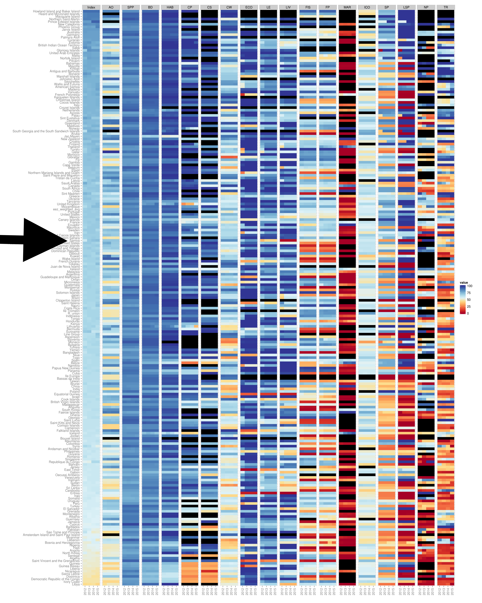

```{r setup, include=FALSE}
knitr::opts_chunk$set(echo = TRUE)
```

- carpet plot 
- oceanhealthindex.org 
- ohi-science.org/ohi-global
- ohi-science.org/mhi

## Discussion Topics:

### Are all goals relevant?

### Individual goals

**Sense of Place: Lasting Special Places**

- Sense of Place is very important to Samoa, and is not well represented by the global models. What would be a better way to represent SP? 
